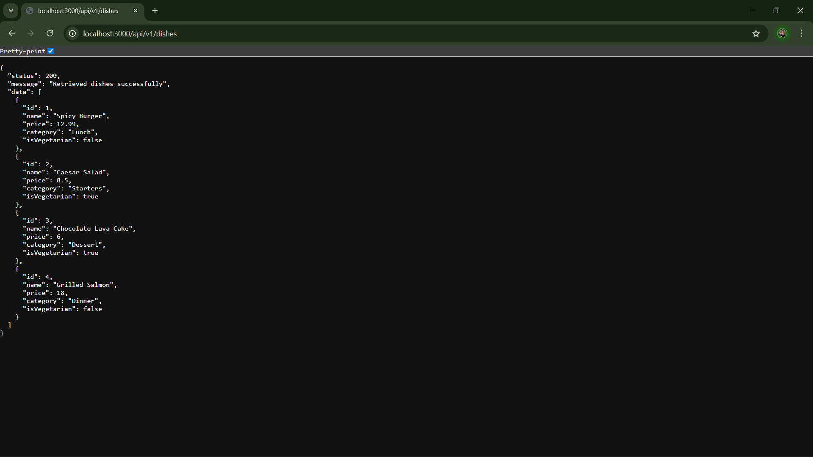

Markdown
# RESTful API Activity - Jhon Kyn Axix H. Cabrigas
## Best Practices Implementation
**1. Environment Variables:**
- Why did we put `BASE_URI` in `.env` instead of hardcoding it?
   - Answer: This is to avoid repetition.

**2. Resource Modeling:**
- Why did we use plural nouns (e.g., `/dishes`) for our routes?
   - Answer: Because we are referring to more than one of that item. This is to ensure precision and avoid confusion for directions.

**3. Status Codes:**
- When do we use `201 Created` vs `200 OK`?
   - Answer: We use 201 Created when a request successfully creates a new resource, while 200 OK is for general success where no new resource is created.

- Why is it important to return `404` instead of just an empty array or a generic error?
   - Answer: This preserves the semantic meaning of the API, which this will indicates that the resource was nowhere to be found.

**4. Testing:**
 - 
**Embed and Referrence**

- "Why did I choose to Embed the [Review/Tag/Log]?"
- Answer: I embedded the review inside the Dish because reviews belong to a specific Dish and are usually shown together. This makes it faster to get the Dish with its reviews and keeps everything in one place, so it’s easier to manage.

- "Why did I choose to Reference the [Chef/User/Guest]?"
- Answer: I referenced the Chef because a Chef can have many Dishes, and we don’t want to duplicate Chef information in every Dish. Referencing keeps the Chef’s details in one place, makes updates easier, and avoids data redundancy.

**1. Authentication vs Authorization:**
- What is the difference between Authentication and Authorization in our
code?
   - Answer: Authentication verifies the identity of the user by checking their login credentials. Authorization determines what actions the authenticated user is allowed to do, such as accessing protected routes or performing admin tasks.

**2. Security(bcrypt):**
- Why did we use bcryptjs instead of saving passwords as plain text in
MongoDB?
   - Answer: We used bcryptjs to hash passwords before saving them in MongoDB. This keeps passwords secure because even if the database is accessed, the real passwords cannot be easily seen.

**3. JWT Structure:**
- What does the protect middleware do when it receives a JWT from the
client?
   - Answer: The protect middleware checks the JSON Web Token sent by the client, verifies if it is valid, and allows the user to access protected routes if the token is correct.